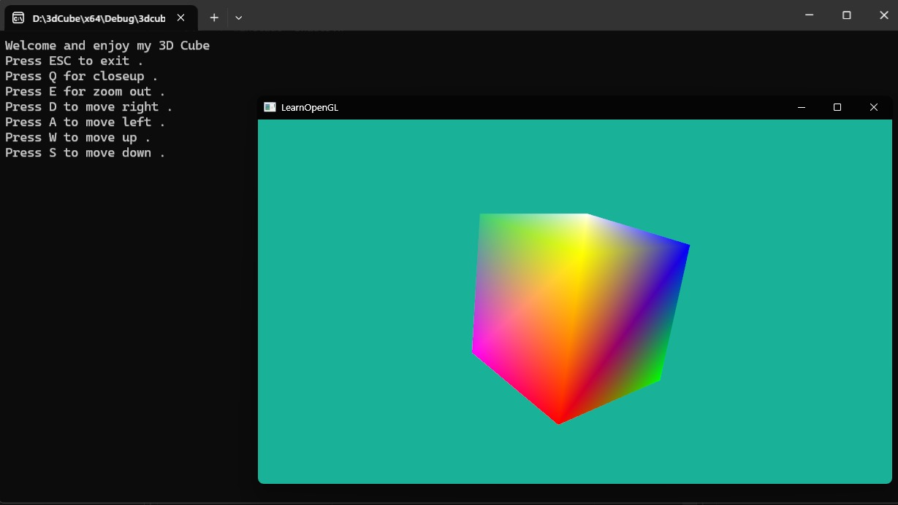

# 3D Cube

## How to Build
1. Clone the repository:
   `git clone https://github.com/DespotS/Computer-Graphics.git`
2. Install the required libraries:
   - GLFW
   - GLAD
   - stb_image
   - glm
3. Open the `3dcube.sln` file in Visual Studio.
4. Build and run the project.

This code is based on learnopengl.com and Michael Grieco yt tutorials on openGL.
