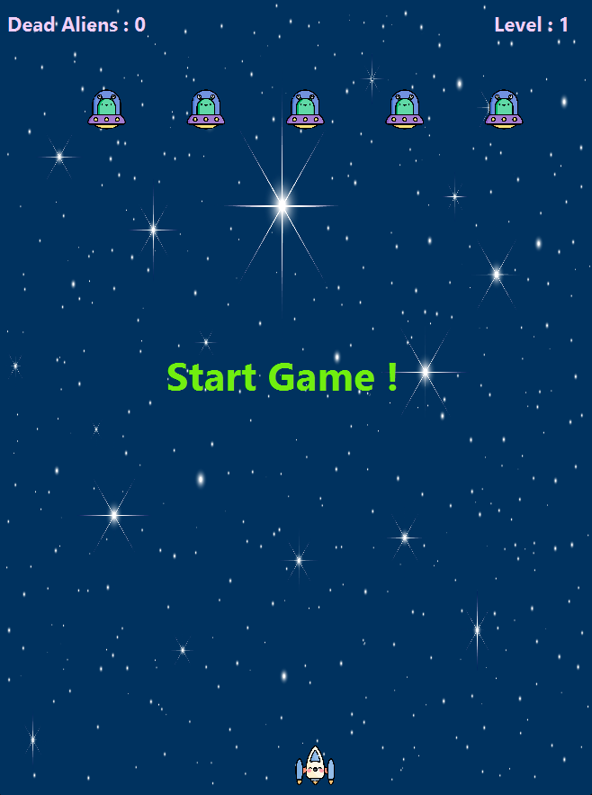

# Space Invaders Game

A modern take on the classic arcade game *Space Invaders*, developed using JavaFX. Defend Earth from waves of aliens and aim for the highest score!



## Features
- **Smooth gameplay** with real-time movement and shooting mechanics.
- **Dynamic levels** that increase in difficulty as you progress.
- **Real-time updates** for the player's score and current level.
- **Game Over detection** with a visual display when the player is hit.
- **Animated background** and space-themed assets for an immersive experience.

## Controls
- **Move Left**: Press the `A` key.
- **Move Right**: Press the `D` key.
- **Shoot**: Press the `SPACE` key.

## How to Run
1. Ensure you have Java and JavaFX installed.
2. Clone the repository or download the game files.
3. Navigate to the project directory and compile the code:
   ```bash
   javac -d bin -sourcepath src src/com/example/spaceinvaders/SpaceInvApplication.java

The following tutorial has been used for the basic setup but modified: https://www.youtube.com/watch?v=FVo1fm52hz0&t=768s&ab_channel=AlmasBaim%28AlmasB%29

Game Assets

Player Ship: spaceship_6542648.png by Freepik
Enemy Ships: ufo_1794534.png by Freepik
Bullets: bullet_17044062.png by Freepik
Background: starry_sky_0508.jpg by Freepik
